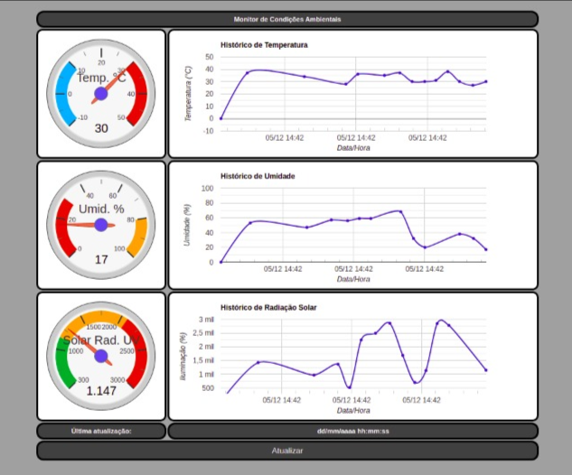

# Smart Class Monitor

---

### Aplicação Web:



### Instalações prévias (Ubunto):
MQTT Client e Servidor: sudo apt install mosquitto mosquitto-clients -y

Paho-mqtt: pip install paho-mqtt

Obs.: Fiz essas execuções com sucesso na minha máquina host (Ubuntu 20.04).

### Tecnologias utilizadas: 
- Sensores Virtuais - foram utilizados os sensores virtuais para simulação de coleta dos dados de temperatura, umidade e radiação solar;
- Mosquitto - message broker de código aberto, implementa o protocolo MQTT. O protocolo MQTT nos fornece um método leve de messagens usando o modelo publish/subscribe;
- Paho JavaScript Client - biblioteca cliente MQTT baseado em navegador, escrita em JavaScript que usa WebSockets para se conectar a um MQTT Broker;
- Chart.js - biblioteca para visualização de dados (gráficos).

### Iniciar sensores virtuais e comunicação entre sensor e gateway:

Os arquivos do sensor virtual(tatu.py; main.py; config.json; sensors.py)  estão na pasta simulador/

### Processo de execução:
Iniciar sensor virtual:
> cd simulador/

python3 main.py --name sc01 --broker broker.hivemq.com
obs: sc01 é o nome do device/sensor e o ip do servidor/gateway é broker.hivemq.com

### Implemetação:

```javascript
 function MQTTConnect() {
        client = new Paho.MQTT.Client('broker.hivemq.com', 8000, '');
        var options = { onSuccess: onConnect,
                        onFailure: onError
                        };
        client.onMessageArrived = onMessageArrived;
        client.onConnectionLost = onError;
        client.connect(options);
    }
```
> Cria uma instância do cliente, define o retorno de chamadas e realiza a conexão do cliente com o broker;

```javascript
 function onConnect() {
        console.log('Connected');

        // sensor de temperatura
        client.subscribe('dev/sc01');
        let message = new Paho.MQTT.Message(`{"method":"GET", "sensor":"temperatureSensor"}`);
        message.destinationName = 'dev/sc01';
        client.send(message);
        client.subscribe('dev/sc01/#');  
        
        // sensor de umidade
        message = new Paho.MQTT.Message(`{"method":"GET", "sensor":"humiditySensor"}`);
        message.destinationName = 'dev/sc01';
        client.send(message);
        client.subscribe('dev/sc01/#');  

        // sensor de radiacao solar
        message = new Paho.MQTT.Message(`{"method":"GET", "sensor":"solarradiationSensor"}`);
        message.destinationName = 'dev/sc01';
        client.send(message);
        client.subscribe('dev/sc01/#');  
    }
```
> É chamado quando o cliente se conecta. 

- Uma vez que a coexão é estabelecida, fazemos a inscrição no device/tópico que desejamos:
```javascript
    // incrição no device que desejamos coletar os dados
    client.subscribe('dev/sc01');
```
- Enviamos a mensagem informando o método e o sensor que queremos, destinationName é o tópico para o qual desejamos enviar a mensagem:
```javascript
    // cria mensagem com metodo e sensor
    message = new Paho.MQTT.Message(`{"method":"GET", "sensor":"temperatureSensor"}`);
    message.destinationName = 'dev/sc01';
    client.send(message);
```
> O método "GET" é passado para informar que queremos "pegar" o dado do sensor 

- Em seguida, fazemos uma inscrição para receber a mensagem com o dados que pedimos:
```javascript
    // incrição para receber resposta do sensor
    client.subscribe('dev/sc01/#'); 
```
- Função chamada quando chega uma mensagem, o dado solicitado fica em `msg.payloadString`:
```javascript
    function onMessageArrived(msg) {
        console.log("Mensagem: " + msg.destinationName + "=" + msg.payloadString);
        ...
    }
```

- Identificamos a mensagem de resposta do sensor com o código abaixo, quando obtemos o dado resposta o adicionamos ao respectivo gráfico:

```javascript
    if (msg.destinationName == "dev/sc01/RES")
        ... 
```


---

> :bulb: **Note:** Os dados são atualizados a cada 30s